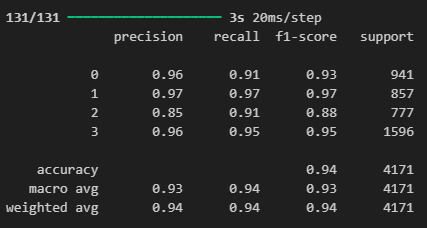

LSTM-Based Text Classification

📌 Project Overview

This project develops a Long Short-Term Memory (LSTM) neural network model for text classification. The model categorizes text into four predefined categories: Electronics, Household, Books, and Clothing & Accessories. The goal is to achieve:

✅ Accuracy: > 85%
✅ F1 Score: > 0.7

📂 Project Structure

├── saved_models/          # Directory to store trained models
│   ├── lstm_model.h5      # Trained LSTM model in HDF5 format
│   ├── lstm_model.keras   # Trained LSTM model in Keras format
│   ├── tokenizer.json     # Tokenizer configuration
│   ├── label_encoder.json # Label encoder mappings
├── data/                  # Dataset folder
│   ├── dataset.csv        # Preprocessed dataset
├── logs/                  # TensorBoard logs for visualization
├── main.py                # Main script for training and evaluation
├── requirements.txt       # Required dependencies
└── README.md              # Project documentation

🛠 Setup Instructions

1️⃣ Install Dependencies

Ensure you have Python 3.7+ installed, then run:

pip install -r requirements.txt

2️⃣ Train the Model

Run the main script to train and evaluate the model:

python main.py

3️⃣ View Training Progress on TensorBoard

To visualize training logs:

tensorboard --logdir=logs

📊 Model Architecture

The model consists of the following layers:

TextVectorization: Converts text into numerical sequences

Embedding Layer: Transforms sequences into dense vector representations

Bidirectional LSTM: Captures long-term dependencies in text

Dropout Layers: Prevents overfitting

Dense Layers: Processes extracted features

🔍 Performance & Evaluation

The model is evaluated based on:

Accuracy: Measures correct predictions

F1 Score: Balances precision and recall

Confusion Matrix: Visualizes misclassifications

🏆 Optimizations Implemented

✔ Dropout Regularization to reduce overfitting
✔ Early Stopping with patience = 3
✔ Reduce Learning Rate when validation loss plateaus
✔ Bidirectional LSTM for better context understanding

🚀 Future Improvements

Implement pretrained embeddings (GloVe, FastText)

Explore GRU instead of LSTM

Apply data augmentation for better generalization

📝 License
This project is open-source 
